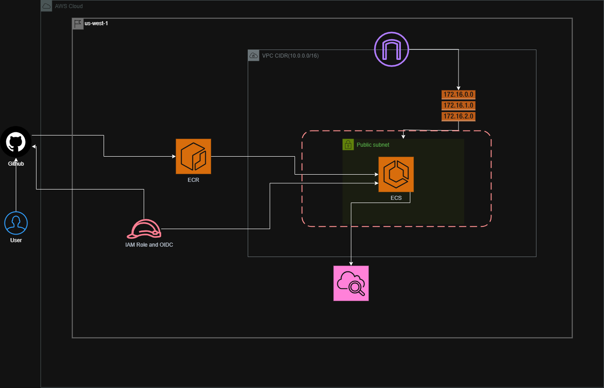

# Task12 – CI/CD Pipeline using GitHub Actions and AWS ECS Fargate

##  Project Overview
This project demonstrates an **end-to-end CI/CD pipeline** for deploying a **Dockerized Node.js application** to **AWS ECS Fargate**, using **GitHub Actions** with **OIDC-based authentication**.

The pipeline automates:
- Docker image build
- Image push to Amazon ECR
- Deployment to ECS Fargate
- Service update with zero manual intervention

No long-term AWS credentials are used.

---

##  Architecture Diagram



---

##  Tech Stack

- **CI/CD**: GitHub Actions  
- **Containerization**: Docker  
- **Container Registry**: Amazon ECR  
- **Orchestration**: Amazon ECS  
- **Compute**: ECS Fargate  
- **Authentication**: IAM Role + OIDC  
- **Logging**: Amazon CloudWatch  
- **Infrastructure**: AWS Console (No Terraform)

---

##  CI/CD Workflow

### Continuous Integration (CI)
Triggered on every push to `main`:
1. Checkout source code
2. Authenticate to AWS using OIDC
3. Build Docker image
4. Tag image (`latest` and commit SHA)
5. Push image to Amazon ECR

### Continuous Deployment (CD)
Triggered after successful CI:
1. Fetch existing ECS task definition
2. Update container image reference
3. Register new task definition revision
4. Update ECS service
5. Wait for service stability

---

##  Repository Structure

```text
.
├── .github/workflows/
│   ├── ci-ecr.yml
│   └── cd-ecs.yml
├── src/
│   ├── server.js
│   ├── public/
│   └── views/
├── Dockerfile
├── package.json
├── package-lock.json
├── .gitignore
└── Task12.PNG
````

---

##  Security Best Practices

* No AWS access keys stored in GitHub
* IAM Role with least-privilege permissions
* Short-lived credentials via OIDC
* Immutable container images using SHA tags
* Controlled deployment through ECS service

---

##  Rollback Strategy

Rollback can be performed using:

1. **Previous ECS task definition revision**
2. **Specific ECR image tag (commit SHA)**

Both options allow quick recovery in case of failed deployments.

---

##  Project Outcome

* Fully automated CI/CD pipeline
* Secure authentication using OIDC
* Zero manual deployments
* Production-style ECS Fargate architecture
* Ready for extension with ALB, HTTPS, and auto-scaling

---

##  Future Enhancements

* Add Application Load Balancer (ALB)
* Enable HTTPS using ACM
* Implement auto-scaling policies
* Add monitoring and alerting

---

##  Author

**Sardar Noor Ul Hassan**
DevOps / Cloud Engineer

---

> This project was implemented as part of a hands-on DevOps learning initiative, focusing on real-world AWS deployment practices.

